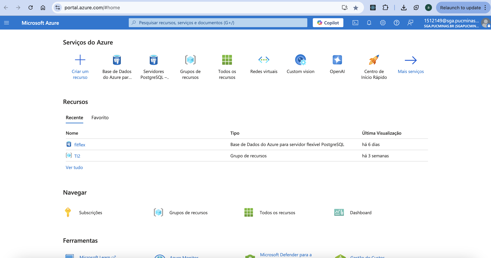
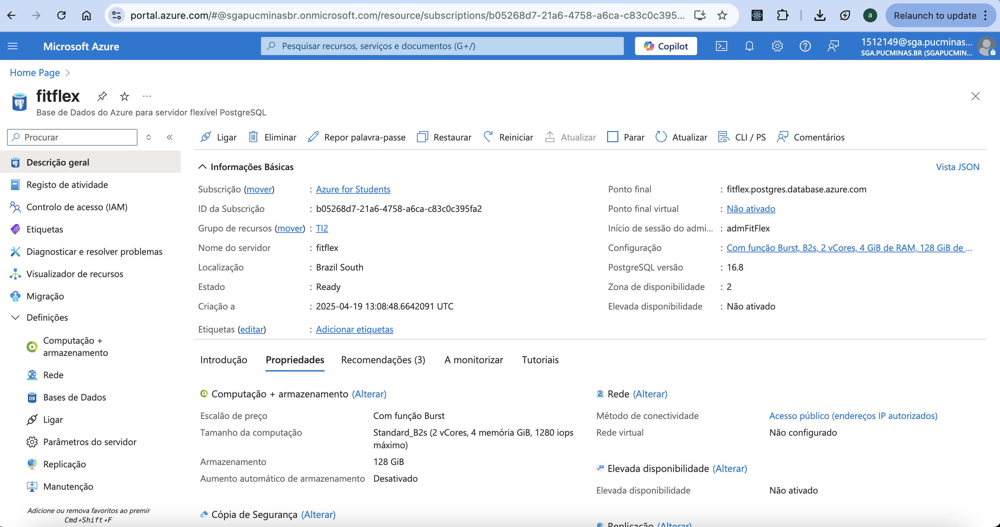
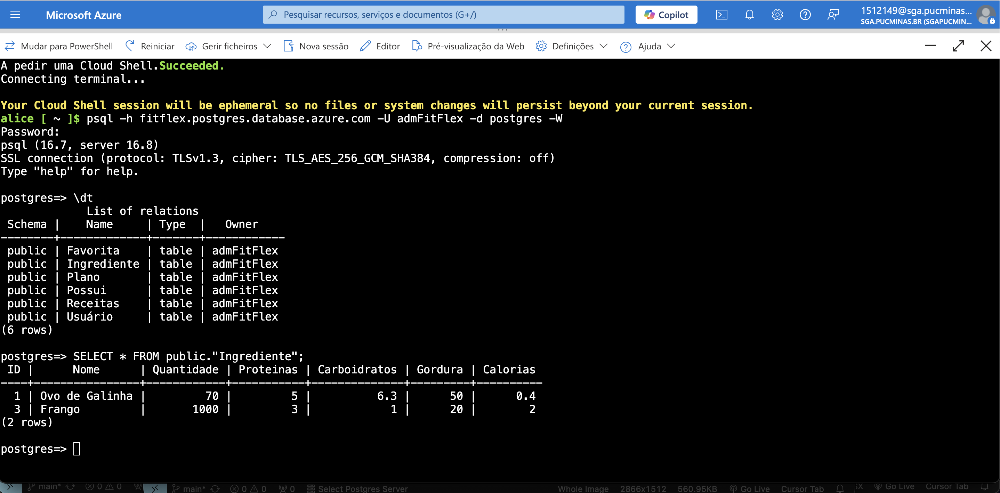
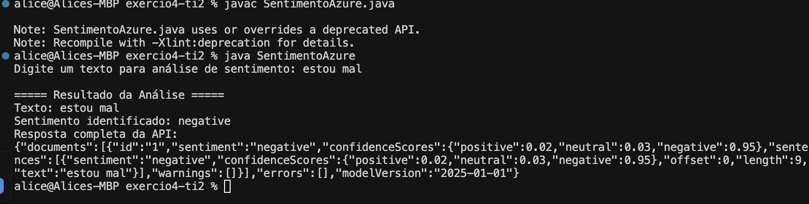

# Exercício 4 - Computação em Nuvem e Serviços Cognitivos

<div style="background-color: #001c54; padding: 20px; border-radius: 12px; margin-bottom: 20px;">
  <h2 style="color: #ffffff; font-family: 'Inter', sans-serif; margin-bottom: 10px;">Microsoft Azure: Banco de Dados e Serviços Cognitivos</h2>
  <p style="color: #ffffff; font-family: 'Inter', sans-serif;">Projeto desenvolvido para a disciplina de Trabalho Interdisciplinar 2 - PUC Minas</p>
</div>

## 📋 Produtos Entregues

### Produto 1: Ativação da conta no Azure
A conta foi ativada com sucesso utilizando o e-mail institucional (@sga.pucminas.br), obtendo os créditos estudantis para utilização na plataforma.



### Produto 2: Banco de Dados PostgreSQL no Azure
Foi criado um banco de dados PostgreSQL chamado "fitflex" na plataforma Azure, configurado com as seguintes características:
- Servidor: fitflex.postgres.database.azure.com
- Localização: Brazil South
- Configuração: Standard_B2s (2 vCores, 4 memória GiB, 1280 iops máximo)
- Armazenamento: 128 GiB



O banco de dados contém tabelas relacionadas a um sistema de gestão de refeições e dietas:
- Favorita
- Ingrediente
- Plano
- Possui
- Receitas
- Usuário

#### Consulta realizada:
```sql
SELECT * FROM public."Ingrediente";
```

Resultado da consulta:



| ID | Nome | Quantidade | Proteínas | Carboidratos | Gordura | Calorias |
|----|------|------------|-----------|--------------|---------|----------|
| 1 | Ovo de Galinha | 70 | 5 | 6.3 | 50 | 0.4 |
| 2 | Frango | 1000 | 3 | 1 | 20 | 2 |

### Produto 3: Serviços Cognitivos - Análise de Sentimento

Para este produto, foi escolhida a opção B: utilização de um serviço cognitivo pronto da Microsoft Azure. O serviço implementado realiza análise de sentimento em textos em português.

O recurso "analisedesentimentos123" foi criado no Azure Cognitive Services, permitindo a análise de sentimentos em textos fornecidos pelo usuário.



#### Implementação em Java:

```java
// Código que consome a API de Análise de Sentimentos
public class SentimentoAzure {
    public static void main(String[] args) throws Exception {
        String endpoint = "https://analisedesentimentos123.cognitiveservices.azure.com/";
        String chave = "99LEATB84Zr3JTlxwBsEstjqJPti4WvjNB2QzEy9EVzuFjuDvcvUJQQJ99BEACYeBjFXJ3w3AAAEACOGfqOv";
        String url = endpoint + "text/analytics/v3.1/sentiment";

        Scanner scanner = new Scanner(System.in);
        System.out.print("Digite um texto para análise de sentimento: ");
        String textoUsuario = scanner.nextLine();
        scanner.close();

        String corpoJson = String.format(
            "{ \"documents\": [ { \"language\": \"pt\", \"id\": \"1\", \"text\": \"%s\" } ] }",
            textoUsuario.replace("\"", "\\\"") // escapa aspas
        );

        String resposta = enviarRequisicao(url, chave, corpoJson);
        String sentimento = extrairSentimento(resposta);

        System.out.println("\n===== Resultado da Análise =====");
        System.out.println("Texto: " + textoUsuario);
        System.out.println("Sentimento identificado: " + sentimento);
        System.out.println("Resposta completa da API:\n" + resposta);
    }
    
    // Método auxiliar para o envio da requisição HTTP
    private static String enviarRequisicao(String urlStr, String chave, String corpo) throws IOException {
        // Implementação da requisição
    }

    // Método para extrair o sentimento da resposta JSON
    private static String extrairSentimento(String json) {
        // Extração do sentimento
    }
}
```

#### Exemplo de Resultado:
Texto analisado: "estou mal"
Resultado: Sentimento negativo (confidence score: 0.95)

## 🛠️ Tecnologias Utilizadas

<div style="display: flex; gap: 10px; margin-bottom: 20px;">
  <div style="background-color: #2374b9; color: white; padding: 10px 20px; border-radius: 8px; font-family: 'Inter', sans-serif;">Microsoft Azure</div>
  <div style="background-color: #001c54; color: white; padding: 10px 20px; border-radius: 8px; font-family: 'Inter', sans-serif;">PostgreSQL</div>
  <div style="background-color: #de5e36; color: white; padding: 10px 20px; border-radius: 8px; font-family: 'Inter', sans-serif;">Java</div>
  <div style="background-color: #edb125; color: white; padding: 10px 20px; border-radius: 8px; font-family: 'Inter', sans-serif;">Azure Cognitive Services</div>
</div>

## 📊 Conclusão
O projeto demonstrou com sucesso a utilização da plataforma Azure para hospedagem de banco de dados e consumo de serviços cognitivos. A integração de serviços de IA como a análise de sentimentos demonstra o potencial de uso dessas tecnologias em aplicações reais.